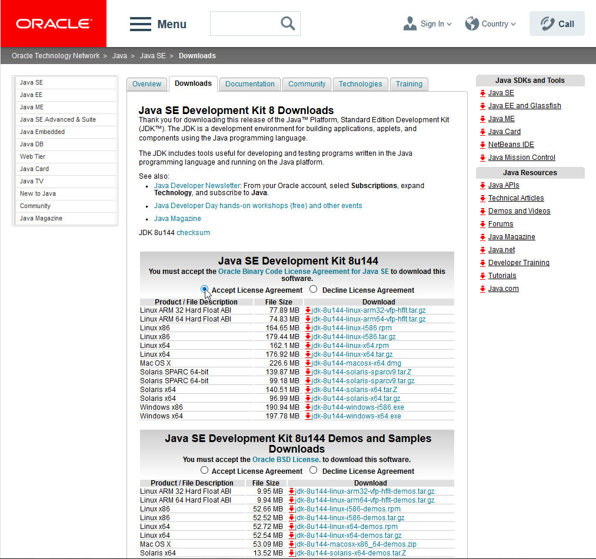
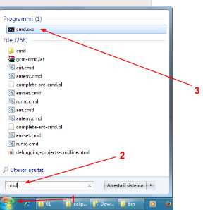
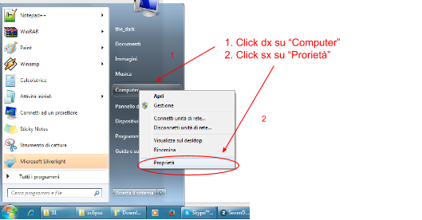
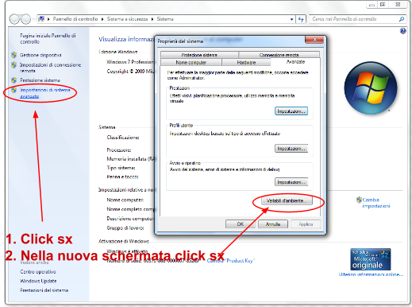
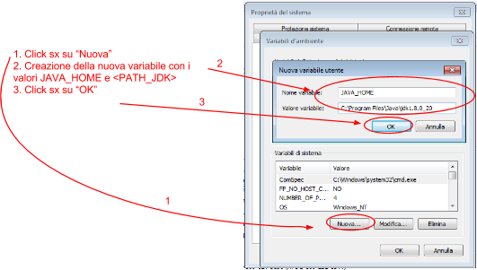
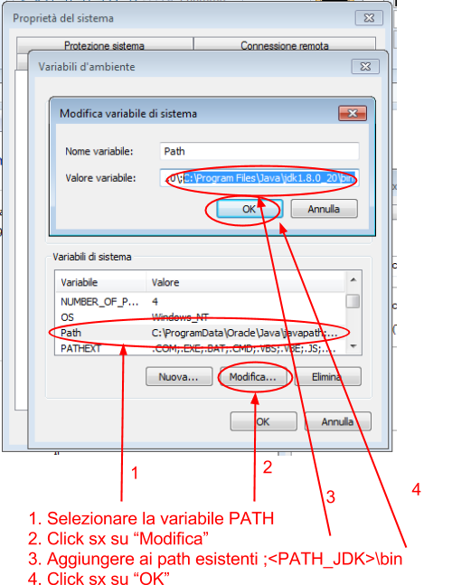
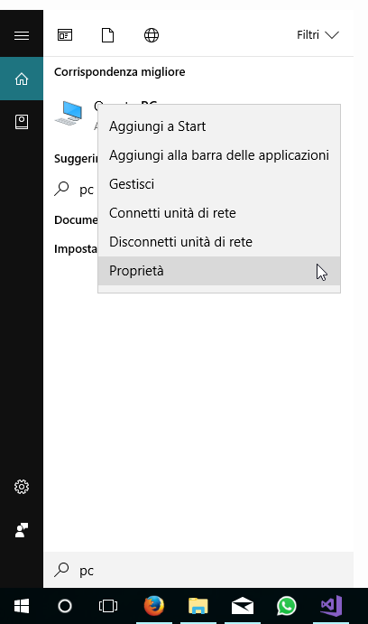
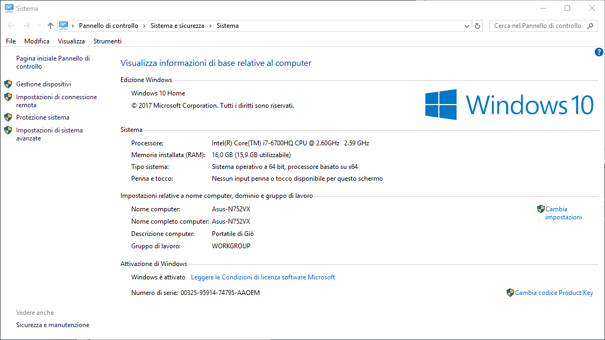
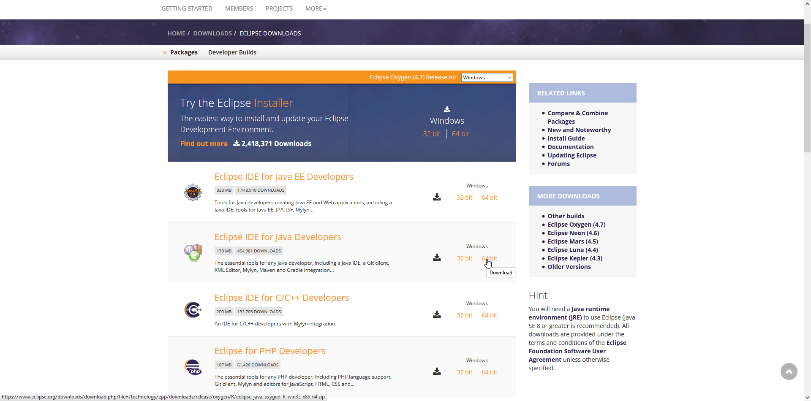
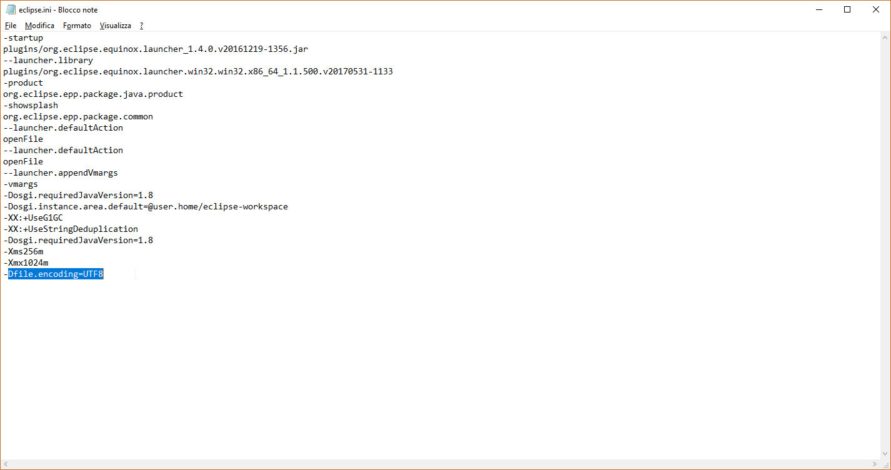

Il seguente documento fornisce le istruzioni necessarie per installare gli strumenti di sviluppo utilizzati nel contesto del corso di Programmazione ad Oggetti.
La guida presenta le procedure di installazione e configurazione su Linux (varie distribuzioni), MacOS X e Windows del **Java Development Kit** (JDK) e dell'ambiente di sviluppo integrato **Eclipse**.

# Java Development Kit (JDK)

Il JDK è l'insieme degli strumenti necessari a sviluppare software standard in Java.
Include la virtual machine Java, le librerie Java, di base, il compilatore, e i tool di contorno.
Seguono le istruzioni di installazione e configuazione per i vari sistemi operativi.

## Linux

In ambiente Linux, la procedura è distro-dependent, ovvero dipendente dal package-manager utilizzato sulla specifica distribuzione.
Si riportano qui le istruzioni per le distribuzioni più famose, più diffuse e/o quelle usate dai docenti.
Tutte le istruzioni hanno forma di comandi da lanciare nel terminale.
Nel caso in cui lo studente utilizzi una diversa distribuzione, si senta libero di contattare i docenti per essere aiutato (va detto che storicamente le richieste sono state zero: chi utilizza una distribuzione poco diffusa di norma sa bene cosa sta facendo).

Le istruzioni specifiche per ogni distribuzione sono indicate nelle sottosezioni sequenti.
In ogni caso, al termine del processo di installazione, per verificare la corretta installazione del JDK, è possibile eseguire da shell il comando: ``javac -version``, accertandosi che l’output prodotto sia del tipo: ``javac 1.8.0_<version>``

Per qualsiasi domanda o problematica riscontrata durante l’installazione, rivolgersi direttamente ai tutor del corso.

### Ubuntu e derivate (Linux Mint, elementaryOS...)
Java 8 non è disponibile sui repository ufficiali, ma è fornito tramite la PPA ``ppa:webupd8team/java``:


sudo add-apt-repository ppa:webupd8team/java
sudo apt-get update
sudo apt-get install oracle-java8-installer
sudo apt-get install oracle-java8-set-default


### Arch e derivate (Antergos, Manjaro, Bridge…)
Arch offre il pacchetto OpenJDK 8 direttamente nel repository principale

sudo pacman -S jdk8-openjdk

È possibile avere più ambienti Java installati contemporaneamente, si può selezionare quello corrente utilizzando il comando ``archlinux-java``.

### Debian
Java 8 non è disponibile sui repository ufficiali, ma è fornito tramite PPA.

su -
echo "deb http://ppa.launchpad.net/webupd8team/java/ubuntu trusty main" | tee /etc/apt/sources.list.d/webupd8team-java.list
echo "deb-src http://ppa.launchpad.net/webupd8team/java/ubuntu trusty main" | tee -a /etc/apt/sources.list.d/webupd8team-java.list
apt-key adv --keyserver hkp://keyserver.ubuntu.com:80 --recv-keys EEA14886
apt-get update
apt-get install oracle-java8-installer
exit


### Gentoo e derivate eccetto Sabayon (Calculate, Scientific…)
Gentoo offre il pacchetto JDK 8 via Portage.
Il pacchetto è soggetto a fetch restriction per via della licenza Oracle, dunque come primo passo dovrete scaricare il JDK per Linux dal sito web di Oracle in formato tar.gz, quindi spostare tale archivio in ``/usr/portage/distfiles/``.
A questo punto, lanciare:

su -
emerge --sync
emerge oracle-jdk-bin
eselect java-vm set system oracle-jdk-bin-1.8
exit
eselect java-vm set user oracle-jdk-bin-1.8

È possibile utilizzare contemporaneamente più versioni del JDK, e cambiare quella di default utilizzando il comando `eselect`. In particolare ``eselect java-vm list`` elenca tutte le Java VM installate nel sistema. È possibile configurare la virtual machine di default per-utente e per-sistema.

### Sabayon

su -
equo u
equo i oracle-jdk-bin
eselect java-vm set system oracle-jdk-bin-1.8
exit
eselect java-vm set user oracle-jdk-bin-1.8

Le medesime considerazioni fatte per Gentoo valgono su Sabayon.

### Distro con package manager RPM (Red Hat, Fedora, SUSE, Oracle, SLES)
In generale è possible utilizzare questa procedura per tutte le distribuzioni dotate del package manager RPM. Scaricare il pacchetto di installazione [dal sito Oracle][JDK download page], selezionando il fomato rpm, e la versione Linux x86 oppure Linux x64 a seconda del sistema operativo rispettivamente a 32 o 64 bit.
Tale informazione può essere stampata a video utilizzando il comando `uname -m`. Quindi:

sudo -s
mkdir /opt/Oracle_Java
cd /opt/Oracle_java
rpm -ivh /path/to/package/jdk-8u<version>-linux-x64.rpm
/usr/sbin/alternatives --config java (selezionare l’indice corrispondente a jdk 8)
/usr/sbin/alternatives --config javac (selezionare l’indice corrispondente a jdk 8)
/usr/sbin/alternatives --config jar (selezionare l’indice corrispondente a jdk 8)
exit


## Mac OS X
1. Scaricare il JDK [dalla pagina di download ufficiale di Oracle][JDK download page], avendo cura di scegliere la versione per **Mac OS X**.

2. Eseguire l’eseguibile scaricato e seguire il wizard di installazione passo passo.
3. Verificare la corretta installazione del JDK eseguendo il comando javac da shell.

## Windows

Su Windows la procedura dipende dalla versione utilizzata.
In particolare, si differenzia fra Windows 7 (e precedenti), Windows 8 e Windows 10 a causa delle variazioni nell'interfaccia grafica.
Versioni inferiori a Windows Vista non sono supportate.

I passi in comune a tutte le versioni di Windows sono i seguenti:
1. Scaricare il JDK dalla [pagina di download ufficiale di Oracle][JDK download page].
Scegliere la versione 32/64 bit corrispondente alla propria versione del sistema operativo (p.e. Windows a 32 bit ---> JDK a 32 bit).

2. Eseguire l’eseguibile scaricato e seguire il wizard di installazione passo-passo.
3. Configurazione delle variabili d'ambiente
    - Questa fase varia leggermente a senconda della versione di Windows. Le istruzioni specifiche di ogni versione sono riportate nel seguito.
4. Verifica dell'avvenuta installazione eseguendo i segenti due comandi su un prompt dei comandi:
    
    javac -version  # Output atteso: 'javac 1.8.0_121'
    java -version   # Output atteso: 'java version "1.8.0_144" ...'
    
    

### Impostazione variabili d'ambiente su Vista / 7

1. Aprire le proprietà di sistema: 

2. Aprire la schermata relativa alle variabili di ambiente: 

3. Configurare la variabile JAVA_HOME come mostrato: 

4. Aggiornare la  variabile d’ambiente PATH come mostrato: 

5. Aprire il prompt dei comandi: 

6. Verificare la corretta installazione del JDK eseguendo il comando `javac -version` e `java -version` dal prompt dei comandi.

### Impostazione variabili d'ambiente su Windows 10

1. Aprire il menù d'avvio e digitare __"Modifica variabili d'ambiente relative al sistema"__:

    - In alternativa, dal menù d'avvio, cercare la voce __"Questo PC"__ e cliccare su di essa col pulsante destro. Dal menù a tendina che apparirà, selezionare la voce __"Proprietà"__:
    
    - Dalla schermata __"Sistema"__ che apparirà, selezionare la voce __"Impostazioni di sistema avanzate"__ (a sinistra):
    

2. Si aprirà la finestra "Proprietà del sistema":

3. Cliccando poi sul pulsante __"Nuova"__ (_quello più in basso!_), si aprirà la finestra di dialogo __"Variabili d'ambiente"__, necessaria per creare una nuova variabile d'ambiente:

4. Creare la variabile denonimata __"JAVA_HOME"__ con valore `C:\Program Files\Java\jdk1.8.<minor_version>` e cliccare sul pulsante __"OK"__:

    - __Nota bene__: il percorso specifico del JDK potrebbe variare da quello qui descritto in caso di installazioni personalizzate.

5. Tornando alla schermata __"Variabili d'ambiente"__, modificare la variabile `Path` (_quella più in basso!_), cliccando sul pulsante __"Modifica"__.

6. Alla lista di percorsi che apparirà, aggingere la voce `%JAVA_HOME%\bin`:

7. Premere su __"OK"__ su tutte le finestre sin qui aperte per confermare le modifiche.

8. Fatto! Verificare la corretta installazione del JDK eseguendo __entrambi__ i comandi `javac -version` e `java -version` dal prompt dei comandi.

# Eclipse

### Arch Linux e derivate (Manjaro, Antergos, Bridge...)
Arch è l’unica distribuzione che manutiene nel repository ufficiale Eclipse all’ultima versione, sempre aggiornato. Gli utenti di Arch possono usare il package manager per installare Eclipse (``sudo pacman -S eclipse``), e saltare direttamente al punto 6, lanciando il comando ``eclipse``.

## Tutti i sistemi operativi

1. Scaricare “Eclipse IDE for Java Developers” (ultima versione disponibile) dalla [pagina di download ufficiale (qui)][Eclipse Download]. Scegliere la versione 32/64 bit corrispondente alla propria versione del JDK (normalmente 64bit).

2. Decomprimere il file scaricato utilizzando il programma di gestione degli archivi che siete abituati ad utilizzare (FileRoller, Ark, 7zip...).

3. Al termine della procedura, aprire la cartella appena scompattata.
Al suo interno dovrebbero essere presenti:
    - l'eseguibile `eclipse` (o `eclipse.exe`, su Windows)
    - il file di configurazione `eclipse.ini`
    - le cartelle `configuration`, `features`, `plugins` e altre...

4. Per utenti Windows e MacOS X:  aprire il file `eclipse.ini` con un editor di testo qualsiasi e aggiungere in fondo la seguente riga: ``-Dfile.encoding=UTF8``.

5. Lanciare l’IDE facendo doppio click sull'eseguibile `eclipse` (o `eclipse.exe`, su Windows) contenuto nella cartella.
    - Si consiglia di creare un collegamento sul desktop (o in un altro punto facilmente raggiungibile) per poter eseguire rapidamente Eclipse.

6. Se l’installazione è andata a buon fine si dovrebbe aprire la schermata di benvenuto dell'IDE.

### Risolvere bug Eclipse / GTK+3 su Linux

Eclipse ha attualmente [un bug noto](https://bugs.eclipse.org/bugs/show_bug.cgi?id=354842) che rende l'interfaccia poco reattiva ed aumenta l'uso della CPU da parte dell'IDE, rendendolo praticamente inusabile.
Tale bug è dovuto al modo in cui SWT (la libreria grafica usata da Eclipse) si interfaccia con GTK+3. Il bug si presenta solo in alcune combinazioni di Eclipse / GTK+3.
Onde evitare qualunque problema di questo tipo, il suggerimento è quello di utilizzare GTK+2.
Per farlo, si utilizzi uno dei seguenti modi:

* Se l'installazione è stata eseguita da package manager, si utilizzi il comando `which eclipse` per individuare la posizione del file eseguibile rappresentante Eclipse (normalmente è `/usr/bin/eclipse`). Il file dovrebbe essere uno script sh, che può essere editato. Si esegua `sudo <EDITOR> <PERCORSO>`, sostituendo a `<EDITOR>` il nome del vostro editor di testi preferito (ad esempio, `nano`) e a `<PERCORSO>` il percorso effettivo del file (ad esempio `/usr/bin/eclipse`). Il file che si apre dovrebbe avere il seguente aspetto:

#!/bin/bash
export ECLIPSE_HOME=/usr/lib/eclipse
exec ${ECLIPSE_HOME}/eclipse "$@"

Lo si modifichi in modo che diventi:

#!/bin/bash
export ECLIPSE_HOME=/usr/lib/eclipse
export SWT_GTK3=0
exec ${ECLIPSE_HOME}/eclipse "$@"

Si salvi il file. Le nuove istanze di Eclipse utilizzeranno GTK+2.

* Se l'installazione è stata fatta manualmente, scaricando il pacchetto dal sito di Eclipse, si individui il file `eclipse.ini` nella cartella di installazione. Lo si apra con un editor di testo. Il file dovrebbe apparire simile a:

-startup
plugins/org.eclipse.equinox.launcher_1.3.100.v20150511-1540.jar
--launcher.library
plugins/org.eclipse.equinox.launcher.gtk.linux.x86_64_1.1.300.v20150602-1417
-product
org.eclipse.epp.package.java.product
--launcher.defaultAction
openFile
-showsplash
org.eclipse.platform
--launcher.XXMaxPermSize
256m
--launcher.defaultAction
openFile
--launcher.appendVmargs                                                                                                                                                                                             
-vmargs                                                                                                                                                                                                             
-Dosgi.requiredJavaVersion=1.7                                                                                                                                                                                      
-XX:MaxPermSize=256m                                                                                                                                                                                                
-Xms256m
-Xmx1024m

Si aggiunga alle opzioni, **prima** di `-vmargs`, la seguente opzione:
``
--launcher.GTK_version
2
``
In modo che il file diventi:

-startup
plugins/org.eclipse.equinox.launcher_1.3.100.v20150511-1540.jar
--launcher.library
plugins/org.eclipse.equinox.launcher.gtk.linux.x86_64_1.1.300.v20150602-1417
-product
org.eclipse.epp.package.java.product
--launcher.defaultAction
openFile
-showsplash
org.eclipse.platform
--launcher.XXMaxPermSize
256m
--launcher.defaultAction
openFile
--launcher.appendVmargs
--launcher.GTK_version
2
-vmargs                                                                                                                                                                                                             
-Dosgi.requiredJavaVersion=1.7                                                                                                                                                                                      
-XX:MaxPermSize=256m                                                                                                                                                                                                
-Xms256m
-Xmx1024m


# Plugin di Eclipse

Eclipse utilizza un'architettura a plug-in. Lungo il corso ne utilizzeremo alcuni che ci forniranno funzionalità aggiuntive.

## FindBugs
* In Eclipse, click Help -> Eclipse Marketplace...
* Nella barra di ricerca, inserire "findbugs", quindi premere Invio
* Uno dei plugin trovati dovrebbe essere "FindBugs Eclipse Plugin", clickare su Install
* Seguire le istruzioni, accettare la licenza, attendere che Eclipse scarichi ed installi il prodotti, accettare l'installazione e riavviare l'IDE.

## PMD
* **NON** installare eclipse-pmd da Eclipse Marketplace
* In Eclipse, click Help -> Install New Software
* Nel campo di testo con etichetta "Work with:", scrivere: https://sourceforge.net/projects/pmd/files/pmd-eclipse/update-site-latest/
* Premere Invio
* PMD for Eclipse 4 apparirà nella lista dei plugin. Selezionatelo e clickate Next.
* Seguire le istruzioni, accettare la licenza, attendere che Eclipse scarichi ed installi il prodotti, accettare l'installazione e riavviare l'IDE.

## Checkstyle
* In Eclipse, click Help -> Eclipse Marketplace...
* Nella barra di ricerca, inserire "checkstyle", quindi premere Invio
* Uno dei plugin trovati dovrebbe essere "Checkstyle Plug-in", clickare su Install
* Seguire le istruzioni, accettare la licenza, attendere che Eclipse scarichi ed installi il prodotti, accettare l'installazione e riavviare l'IDE.

# Git

Git è un decentralized version control system (DVCS), che consente di tenere traccia della storia di un progetto, versionarla, tornare allo stato precedente, e lavorare in parallelo.

Al termine del processo di installazione, per verificarne la correttezza, è possibile eseguire da shell il comando: ``git``, accertandosi che l’output prodotto sia del tipo:


usage: git [--version] [--help] [-C <path>] [-c name=value]
           [--exec-path[=<path>]] [--html-path] [--man-path] [--info-path]
           [-p | --paginate | --no-pager] [--no-replace-objects] [--bare]
           [--git-dir=<path>] [--work-tree=<path>] [--namespace=<name>]
           <command> [<args>]

These are common Git commands used in various situations:

start a working area (see also: git help tutorial)
   clone      Clone a repository into a new directory
   init       Create an empty Git repository or reinitialize an existing one

work on the current change (see also: git help everyday)
   add        Add file contents to the index
   mv         Move or rename a file, a directory, or a symlink
   reset      Reset current HEAD to the specified state
   rm         Remove files from the working tree and from the index

examine the history and state (see also: git help revisions)
   bisect     Use binary search to find the commit that introduced a bug
   grep       Print lines matching a pattern
   log        Show commit logs
   show       Show various types of objects
   status     Show the working tree status

grow, mark and tweak your common history
   branch     List, create, or delete branches
   checkout   Switch branches or restore working tree files
   commit     Record changes to the repository
   diff       Show changes between commits, commit and working tree, etc
   merge      Join two or more development histories together
   rebase     Reapply commits on top of another base tip
   tag        Create, list, delete or verify a tag object signed with GPG

collaborate (see also: git help workflows)
   fetch      Download objects and refs from another repository
   pull       Fetch from and integrate with another repository or a local branch
   push       Update remote refs along with associated objects

'git help -a' and 'git help -g' list available subcommands and some
concept guides. See 'git help <command>' or 'git help <concept>'
to read about a specific subcommand or concept.


## Linux

Git è preinstallato in molte distribuzioni.
Si raccomanda quindi di testare se sia già presente eseguendo `git` su terminale prima di partire con l'eventuale installazione.
Se già presente, ovviamente, non occorre intraprendere alcuna azione.

Se non fosse installato, è di norma installabile dal package manager.
Le istruzioni per tutte le distribuzioni più comuni [sono disponibili qui](https://git-scm.com/download/linux).

## Windows
1. Scaricare “GIT for Windows” (nella versione specifica per la propria architettura x86 o x64) dalla [pagina di download ufficiale][GIT-Windows Download].
2. Eseguire il programma di installazione
    * Accettare la licenza > Next > Next
    * **IMPORTANTE:** Selezionare "Use Git from the Windows Command Prompt" > Next
    * Accettare le successive opzioni proposte dall'installer > Install > Finish
3. Verificare la correttezza dell'installazione
    * Aprire il prompt dei comandi (`cmd.exe`)
    * Se il tool è stato installato correttamente, digitando il comando `git` apparirà l'help relativo al comando stesso

## Mac OS X
1. Scaricare l'installer di Git per OS X dalla [pagina di download ufficiale][GIT-OSX Download]
2. Eseguire il programma per l'installazione
    * Eventualmente, eseguire l'installer anche se non sviluppato da una fonte identificata da Apple Store (vedi System preferences > Security > General)
    * Continue > Install
3. Verificare la correttezza dell'installazione
    * Aprire una shell
    * Eseguire il comando `git`: se l'installazione è andata a buon fine, apparirà il menu di help per il comando

[JDK download page]: http://www.oracle.com/technetwork/java/javase/downloads/jdk8-downloads-2133151.html
[Mercurial download page]: https://www.mercurial-scm.org/downloads
[Eclipse Download]: https://www.eclipse.org/downloads/
[GIT-Windows Download]: https://git-for-windows.github.io/
[GIT-OSX Download]: http://git-scm.com/download/mac
