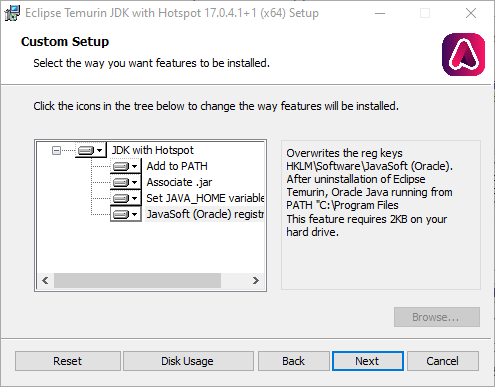

Il seguente documento fornisce le istruzioni necessarie per installare gli strumenti di sviluppo utilizzati nel contesto del corso di Programmazione ad Oggetti.
La guida presenta le procedure di installazione e configurazione su Linux (varie distribuzioni), MacOS X e Windows del **Java Development Kit** (JDK) e dell'ambiente di sviluppo integrato **Visual Studio Code**.

# Java Development Kit (JDK)

Il JDK è l'insieme degli strumenti necessari a sviluppare software standard in Java.
Include la virtual machine Java, le librerie Java, di base, il compilatore, e i tool di contorno.

Esistono varie versioni del JDK, quella di riferimento è OpenJDK, a partire dalla quale ne vengono sviluppate altre sia gratuite che a pagamento (fra cui [Oracle JDK](https://www.oracle.com/java/technologies/downloads/), [Eclipse OpenJ9](https://www.eclipse.org/openj9/), [Amazon Corretto](https://aws.amazon.com/corretto/), [GraalVM](https://www.graalvm.org/), [Bellsoft Liberica JDK](https://bell-sw.com/), [Azul Zulu](https://www.azul.com/downloads/zulu-community/?&show-old-builds=true)...).

A sua volta, OpenJDK è distribuito in forma di sorgente, e vari distributori ne forniscono versioni binarie.
Fra questi, [Adoptium](https://adoptium.net/).
La macchina virtuale Java di riferimento sarà OpenJDK 21 come fornita da Adoptium.

Seguono le istruzioni di installazione e configuazione per i vari sistemi operativi.

## Linux

### Arch e derivate (Manjaro, Bridge, SteamOS...)

Arch offre il pacchetto OpenJDK 21 direttamente nel repository `extra`:

```bash
sudo pacman -Syu
sudo pacman -S jdk21-openjdk
```

È possibile avere più ambienti Java installati contemporaneamente, si può selezionare quello corrente utilizzando il comando ``archlinux-java``.
Per assicurarsi di star lavorando con OpenJDK 21, si utilizzi:

```bash
sudo archlinux-java set java-21-openjdk
```

### Debian e Ubuntu

Installare il deb da: [https://pkgs.org/download/openjdk-21-jdk](https://pkgs.org/download/openjdk-21-jdk)

### Altre distribuzioni

Data la varietà di versioni, distribuzioni sorgenti, e distribuzioni binarie di JVM, esiste un tool Linux che consente di installare quella desiderata e cambiarla rapidamente.
Il tool è [Jabba](https://github.com/shyiko/jabba).

Per installare Jabba su Linux o Mac OS X, si lanci il seguente comando da terminale:

```bash
curl -sL https://github.com/shyiko/jabba/raw/master/install.sh | bash && . ~/.jabba/jabba.sh
```

Una volta che Jabba è installato, può essere utilizzato per installare il JDK.
Si elenchino tutte le versioni di OpenJDK utilizzando

```bash
jabba ls-remote openjdk@
```

Quindi si selezioni la più recente fra le versioni 17, ad esempio se l'output è:

```bash
openjdk@1.17.0
openjdk@1.16.0
openjdk@1.16.0-1
openjdk@1.15.0
openjdk@1.15.0-2
openjdk@1.15.0-1
openjdk@1.14.0
openjdk@1.14.0-2
openjdk@1.14.0-1
openjdk@1.13.0
openjdk@1.13.0-2
openjdk@1.13.0-1
openjdk@1.12.0
openjdk@1.12.0-2
openjdk@1.12.0-1
openjdk@1.11.0
openjdk@1.11.0-2
openjdk@1.11.0-1
openjdk@1.10.0
openjdk@1.10.0-2
openjdk@1.10.0-1
openjdk@1.9.0
openjdk@1.9.0-4
openjdk@1.9.0-1
```

Si scelga `openjdk@1.17.0`.
A questo punto si installi utilizzando i seguenti comandi:

```bash
jabba install openjdk@1.17.0
jabba use openjdk@1.17.0
```

Per impostare una versione di default del JDK da usare (senza dover ogni volta utilizzare `jabba use`) all'apertura di un nuovo terminale, si usi il seguente comando:

```bash
jabba alias default <default-version>
```

Infatti, all'installazione, Jabba modifica file nella `$HOME` come`.bashrc`, `.bash_profile`, o `.zshrc` per chiamare `$HOME/.jabba/jabba.sh`; in quest'ultimo script, un comando `jabba use default` viene invocato: l'effetto è che all'apertura di un nuovo terminale, verrà automaticamente indicato di usare la versione di default del JDK indicata con Jabba.

## macOS

Si seguano le istruzioni per Linux / Jabba.

## Windows

### Tramite `winget`

È possibile installare la distribuzione di Adoptium JDK 17 attraverso il seguente comando su `PowerShell`:

```powershell
winget install -e --id EclipseAdoptium.Temurin.17.JDK
```

L'installazione del pacchetto dovrebbe automaticamente impostare la variabile d'ambiente `JAVA_HOME` correttamente.  
In caso contrario, fare riferimento alla sezione [Configurazione manuale delle variabili d'ambiente](#configurazione-manuale-delle-variabili-dambiente).

Riavviare la `PowerShell` per verificare la corretta installazione del JDK.

### Tramite installer `.msi`

I passi in comune a tutte le versioni di Windows sono i seguenti (di seguito si fa riferimento a Windows 10, analogamente per le versioni precedenti con eventuali variazioni in termini di interfaccia utente):

1. Scaricare il JDK dalla [pagina di download ufficiale di Adoptium](https://adoptium.net/temurin/releases).
   Scegliere la versione 17, filtrando anche per sistema operativo (Windows) e per architettura (x64). Cliccare il download <i class="fa fa-download"></i>`.msi`.
   
   
   
2. Eseguire l'installer scaricato e seguire il wizard di installazione passo-passo.

   

   Nella schermata dell'installer sopra riportata è possibile optare per la configurazione automatica delle variabili d'ambiente (si suggerisce di spuntare tutte le opzioni e procedere con l'installazione.
   In questo caso, terminata l'installazione passare direttamente al punto 4)

3. Configurazione delle variabili d'ambiente (come riportato di seguito, se necessario).

4. (Dopo aver configurato le variabili d'ambiente, se necessario)
   Aprire un prompt dei comandi per verificare l'esito positivo dello step precedente (per aprire il prompt dei comandi è sufficente cercare `cmd.exe` nel menù di Start):

5. Verificare l'avvenuta installazione eseguendo i seguenti due comandi su un prompt dei comandi:
    
    javac -version  # Output atteso: 'javac <version>'
    java -version   # Output atteso: 'java version "<version>" ...'
    

### Tramite package manager

Su Windows sono disponibli diversi pacakge manager non ufficiali o semi-ufficiali che permettono l'installazione di distribuzioni OpenJDK.

#### Opzione 1: Chocolatey

Se sulla macchina [è installato Chocolatey](https://chocolatey.org/docs/installation), è possibile installare OpenJDK 17 eseguendo il seguente comando su un terminale con permessi di amministratore:

```powershell
choco install openjdk17
```

L'installazione dovrebbe eseguire una configurazione automatica delle variabili d'ambiente.

#### Opzione 2: Scoop

Se sulla macchina [è installato Scoop](https://scoop.sh), è possibile installare OpenJDK 17 eseguendo il seguente comando su un terminale:

```powershell
scoop bucket add java

scoop install openjdk17
```

Non è necessario utilizzare un terminale con permessi di amministratore.
L'installazione dovrebbe eseguire una configurazione automatica delle variabili d'ambiente.

#### Opzione 3: Jabba

**Nota**: le ultime versioni presentano alcuni bug nell'installazione e dunque questa soluzione non è consigliata

Per installare Jabba su Windows 10, si lanci il seguente comando su un terminale Powershell:

```powershell
[Net.ServicePointManager]::SecurityProtocol = [Net.SecurityProtocolType]::Tls12
Invoke-Expression (
  Invoke-WebRequest https://github.com/shyiko/jabba/raw/master/install.ps1 -UseBasicParsing
).Content
```

A questo punto si installi utilizzando i seguenti comandi:

```bash
jabba install openjdk@1.17.0
jabba use openjdk@1.17.0
```

Jabba installa il JDK desiderato in una cartella dedicata nella user home dell'utente, ovvero: `%HOMEPATH%\.jabba\jdk\<version>`.

### Configurazione manuale delle variabili d'ambiente

**ATTENZIONE:** eseguire questa procedura solo se le variabili d'ambiente non sono state correttamente settate dalla procedura di installazione.

Non tutti i sistemi di installazione di Java su Windows configurano in modo opportuno l'ambiente.
Se la verifica di funzionamento dovesse fallire,
si verifichi di aver configurato correttamente il proprio ambiente perché possa eseguire il compilatore ed l'interprete Java.
La configurazione richiede vi sia una variabile d'ambiente (`JAVA_HOME`) che punta al percorso di installazione del JDK,
e che nella variabile `PATH` appaia tale percorso con in più il suffisso `bin`
(gli eseguibili `java.exe`, `javac.exe`, `javap.exe`, `javadoc.exe`, `jar.exe` eccetera stanno in quel percorso).

Nella seguente guida si fa riferimento a Windows 10, per versioni precedenti la procedura è analoga.

1. Aprire il menù d'avvio e digitare __"Modifica variabili d'ambiente relative al sistema"__:

   

2. Cliccando su __Apri__ Si aprirà la finestra "Proprietà del sistema":

   

   dalla quale sarà necessario cliccare sul bottone __Variabili d'ambiente__.

3. Si aprirà la finestra di dialogo __"Variabili d'ambiente"__.

   Cliccando poi sul pulsante __"Nuova"__ (_quello più in basso, relativo alle variabili d'ambiente di sistema_)

   

4. Creare la variabile denonimata __"JAVA_HOME"__ con uno dei valori seguenti e cliccare sul pulsante __"OK"__:

   - `%HOMEPATH%\.jabba\jdk\<version>` se si è utilizzato Jabba;
       - **si sostituisca a `<version>` l'effettiva versione!**
   - `C:\Program Files\AdoptOpenJDK\jdk-<version>-hotspot` se si è utilizzato l'installer di AdoptOpenJDK;
       - **si sostituisca a `<version>` l'effettiva versione!**

   

   - __Nota bene__: il percorso specifico del JDK potrebbe variare da quelli qui descritti in caso di installazioni personalizzate.

5. Tornando alla schermata __"Variabili d'ambiente"__, modificare la variabile `Path` (_quella più in basso!_), cliccando sul pulsante __"Modifica"__.

6. Alla lista di percorsi che apparirà, aggingere la voce `%JAVA_HOME%\bin`:

   

7. Premere su __"OK"__ su tutte le finestre sin qui aperte per confermare le modifiche.

8. Fatto!
   Verificare la corretta installazione del JDK eseguendo __entrambi__ i comandi `javac -version` e `java -version` da un *nuovo* prompt dei comandi
   (va riaperto *dopo* il salvataggio della modifica).

## Verifica del funzionamento

Al fine di testare l'esecuzione, si chiuda il terminale, si apra un nuovo terminale, e si eseguano i comandi:

```bash
java -version
javac -version
```

e si osservi il risultato. L'output atteso dovrà essere analogo a:

```bash
$ java -version
openjdk version "17.0.4" 2022-07-19
OpenJDK Runtime Environment (build 17.0.4+8)
OpenJDK 64-Bit Server VM (build 17.0.4+8, mixed mode)


$ javac -version
javac 17.0.4
```

Si noti, in particolare, la versione 17, ed il provider AdoptOpenJDK.


# Visual Studio Code

Visual Studio Code è un editor di testo e IDE con supporto a molti linguaggi di programmazione (incluso Java).

## Linux

[Istruzioni per tutte le distribuzioni](https://code.visualstudio.com/docs/setup/linux)

### Arch Linux e derivate (Manjaro, Bridge, SteamOS...)

La versione Open Source è installabile dal repository `extra`,
tipicamente abilitato di default:

```bash
sudo pacman -Syu
sudo pacman -S code
```

In alternativa, la versione completa non open source è disponibile nel repository
[Chaotic AUR](https://aur.chaotic.cx/).

Si abiliti Chaotic AUR usando le istruzioni presenti al link precedente, quindi:

```bash
sudo pacman -Sy
sudo pacman -S visual-studio-code-bin
```

### Distribuzioni con supporto a Flatpak

È disponibile un pacchetto dedicato su [Flathub](https://flathub.org/apps/details/com.visualstudio.code)

## macOS

https://code.visualstudio.com/docs/setup/mac

## Windows

### Tramite `winget`

È possibile installare `VisualStudio Code` attraverso il seguente comando `PowerShell`:

```bash
winget install -e --id Microsoft.VisualStudioCode
```

### Tramite installer

https://code.visualstudio.com/docs/setup/windows


# Git

Git è un decentralized version control system (DVCS), che consente di tenere traccia della storia di un progetto, versionarla, tornare allo stato precedente, e lavorare in parallelo.

Al termine del processo di installazione, per verificarne la correttezza, è possibile eseguire da shell il comando: ``git``, accertandosi che l’output prodotto sia del tipo:

```bash
usage: git [--version] [--help] [-C <path>] [-c name=value]
           [--exec-path[=<path>]] [--html-path] [--man-path] [--info-path]
           [-p | --paginate | --no-pager] [--no-replace-objects] [--bare]
           [--git-dir=<path>] [--work-tree=<path>] [--namespace=<name>]
           <command> [<args>]

These are common Git commands used in various situations:

start a working area (see also: git help tutorial)
   clone      Clone a repository into a new directory
   init       Create an empty Git repository or reinitialize an existing one

work on the current change (see also: git help everyday)
   add        Add file contents to the index
   mv         Move or rename a file, a directory, or a symlink
   reset      Reset current HEAD to the specified state
   rm         Remove files from the working tree and from the index

examine the history and state (see also: git help revisions)
   bisect     Use binary search to find the commit that introduced a bug
   grep       Print lines matching a pattern
   log        Show commit logs
   show       Show various types of objects
   status     Show the working tree status

grow, mark and tweak your common history
   branch     List, create, or delete branches
   checkout   Switch branches or restore working tree files
   commit     Record changes to the repository
   diff       Show changes between commits, commit and working tree, etc
   merge      Join two or more development histories together
   rebase     Reapply commits on top of another base tip
   tag        Create, list, delete or verify a tag object signed with GPG

collaborate (see also: git help workflows)
   fetch      Download objects and refs from another repository
   pull       Fetch from and integrate with another repository or a local branch
   push       Update remote refs along with associated objects

'git help -a' and 'git help -g' list available subcommands and some
concept guides. See 'git help <command>' or 'git help <concept>'
to read about a specific subcommand or concept.
```

## Linux

Git è preinstallato in molte distribuzioni.
Si raccomanda quindi di testare se sia già presente eseguendo `git` su terminale prima di partire con l'eventuale installazione.
Se già presente, ovviamente, non occorre intraprendere alcuna azione.

Se non fosse installato, è di norma installabile dal package manager.
Le istruzioni per tutte le distribuzioni più comuni [sono disponibili qui](https://git-scm.com/download/linux).

## Windows

### Tramite `winget`

È possibile installare `git` attraverso il seguente comando su `PowerShell`:

```powershell
winget install -e --id Git.Git
```

Riavviare la `PowerShell` per verificare la corretta installazione di `git`.

### Tramite installer

1. Scaricare “GIT for Windows” (nella versione specifica per la propria architettura x86 o x64) dalla [pagina di download ufficiale](https://git-scm.com/download/win).
2. Eseguire il programma di installazione
    * Accettare la licenza > Next > Next > Next > Next
    * Selezionare come editor di testo uno tra:
        * "Use the nano editor by default"
        * "Use Notepad++ as Git's default editor" (se Notepad++ non è già presente, richiede di installarlo prima di poter proseguire con l'installazione di git)
    * Premere Next > Next > Next
    * Selezionare "Checkout as-is, commit as-is" quindi Next
    * Accettare le successive opzioni proposte dall'installer > Install > Finish
3. Verificare la correttezza dell'installazione
    * Aprire il prompt dei comandi (`cmd.exe`)
    * Se il tool è stato installato correttamente, digitando il comando `git` apparirà l'help relativo al comando stesso

## macOS
1. Scaricare l'installer di Git per OS X dalla [pagina di download ufficiale](https://git-scm.com/download/mac)
2. Eseguire il programma per l'installazione
    * Eventualmente, eseguire l'installer anche se non sviluppato da una fonte identificata da Apple Store (vedi System preferences > Security > General)
    * Continue > Install
3. In alternativa ai due step 1 e 2, git è contenuto tra gli XCode Command Line Developer Tools che sicuramente vi è capitato di installare (o avrete la necessità di installare in futuro) per compilare sorgenti C. 
   * Aprite il terminale, lo trovate sotto /Applications/Utilities/
   * Eseguite il comando: ``git``
   * Si aprirà una finestra che vi dice che xcode-select ha bisogno dell'installazione dei Command Line Tools, chiedendo se vogliamo installarli subito.
   * Confermate cliccando su Installa.
4. Verificare la correttezza dell'installazione
    * Aprire una shell
    * Eseguire il comando `git`: se l'installazione è andata a buon fine, apparirà il menu di help per il comando
